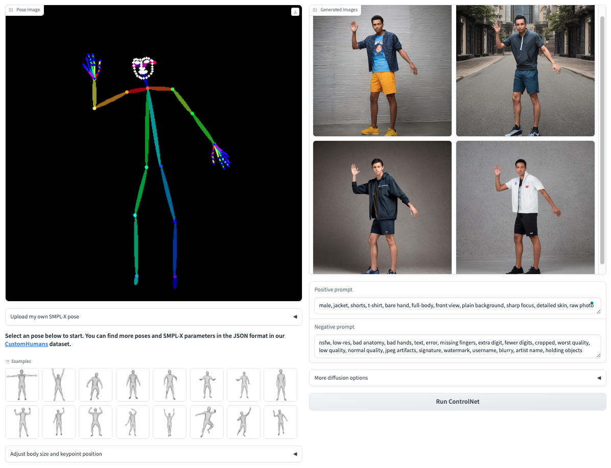
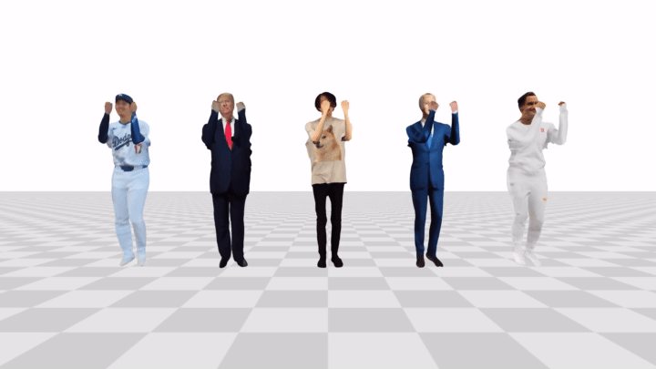

# SiTH: Single-view Textured Human Reconstruction with Image-Conditioned Diffusion

## [Project Page](https://ait.ethz.ch/sith) | [Paper](https://arxiv.org/abs/2311.15855) | [Youtube(6min)](https://www.youtube.com/watch?v=gixakzI9UcM), [Shorts(15sec)](https://youtube.com/shorts/U5sL3zcSBK8?si=TRPosNAbqZz_oqjQ) | [Online Demo](https://ait.ethz.ch/sith-demo)

 

**Official code release for CVPR 2024 paper [SiTH](https://ait.ethz.ch/sith)**.


What you can find in this repo:
* Demo for reconstructing a fully textured 3D human from a single image in 2 minutes (tested on an RTX 3090 GPU)
* A minimal script for fitting the SMPL-X model to an image.
* A new evaluation benchmark for single-view 3D human reconstruction.
* A Gradio demo for creating 3D humans with poses and text prompts.
- [ ] [TODO] Training scripts for the diffusion model and the mesh reconstruction model.

If you find our code and paper useful, please cite it as
```
@inproceedings{ho2024sith,
    title={SiTH: Single-view Textured Human Reconstruction with Image-Conditioned Diffusion},
    author={Ho, Hsuan-I and Song, Jie and Hilliges, Otmar},
    booktitle={Proceedings of the IEEE Conference on Computer Vision and Pattern Recognition (CVPR)},
    year={2024}
  }
```

## News

* [May 15, 2024] Update an application of 3D avatar animation.
* [April 24, 2024] Gradio demo for 3D human creation is now available.
* [April 15, 2024] Release demo code, models, and the evaluation benchmark.


## Installation
Our code has been tested with PyTorch 2.1.0, CUDA 12.1, and an RTX 3090 GPU.

Simply run the following command to install relevant packages:

```bash
pip install -r requirements.txt
```


## Quick Start

1. Download the checkpoint files into the `checkpoints` folder.

```bash
bash tools/download.sh
```

2. Download  [SMPL-X](https://smpl-x.is.tue.mpg.de/) models and move them to the `data/body_models` folder. You should have the following data structure:
```
body_models
    └──smplx
        ├── SMPLX_NEUTRAL.pkl
        ├── SMPLX_NEUTRAL.npz
        ├── SMPLX_MALE.pkl
        ├── SMPLX_MALE.npz
        ├── SMPLX_FEMALE.pkl
        └── SMPLX_FEMALE.npz
```

3. Run the script for body fitting, back hallucination, and mesh reconstruction.
```bash
bash run.sh
```

## Gradio Demo
 

We create an application combining SiTH and powerful [ControlNet](https://github.com/lllyasviel/ControlNet-v1-1-nightly) for 3D human creation. In the demo, users can easily create 3D humans with several button clicks. 

You can either play our [Online Demo](https://ait.ethz.ch/sith-demo) or launch the web UI locally. To run the demo on your local machine, simply run
```bash
python app.py
```
You will see the following web UI on [http://127.0.0.1:7860/](http://127.0.0.1:7860/).

 

## 3D Avatars
SiTH can be used for creating animatable 3D avatars from images. You can generate a textured mesh with a UV map by modifying the command at [`run.sh`](https://github.com/SiTH-Diffusion/SiTH/blob/main/run.sh#L16) with

```bash
python reconstruct.py --test-folder data/examples --config recon/config.yaml --resume checkpoints/recon_model.pth --grid-size 300 --save-uv
```
⚠️ You need to install an additional package for UV unwrapping `pip install xatlas`. Note that UV unwrapping takes a long computational time (>10 mins per mesh). Therefore, it should be only used for the avatar animation application.

We fit and repose the reconstructed textured meshes using [Editable-humans](https://github.com/custom-humans/editable-humans).
Please check their [demo code](https://github.com/custom-humans/editable-humans/blob/main/demo.py) to see how to repose a 3D human mesh.

 

## SiTH Pipeline

### Data Preparation
You can prepare your own **RGBA** images and put them into the `data/examples/rgba` folder. For example, you can create photos from [OutfitAnyone](https://huggingface.co/spaces/HumanAIGC/OutfitAnyone), and remove the background with [Segment Anything](https://segment-anything.com/demo) or [Clipdrop](https://clipdrop.co/remove-background).

1. Run the script to generate square and centralized input images into the `data/examples/images` folder. The default size is 1024x1024. You can also adjust the size by adjusting the `--size` and `--ratio` arguments. 

```bash
python tools/centralize_rgba.py
```

2. Install and run [openpose](https://github.com/CMU-Perceptual-Computing-Lab/openpose) to get `.json` files of COCO-25 body, hand, and face keypoints. For example, we used the following command, and your image folder should contain files as in [`data/examples/images`](https://github.com/SiTH-Diffusion/SiTH/tree/main/data/examples/images).
```bash!
cd /path/to/openpose_dir

./build/examples/openpose/openpose.bin --image_dir /path/to/images_dir --write_json /path/to/images_dir --display 0 --net_resolution -1x544 --scale_number 3 --scale_gap 0.25 --hand --face --render_pose 0
```

### SMPL-X Fitting

Next, we fit the SMPL-X body model to each input image and align them within a cube of [-1, 1]. By default, we use the following command that optimizes the global orientation, body shape, scale, and X,Y offset parameters. 
```
python fit.py --opt_orient --opt_betas
```
There are also additional arguments and hyperparameters for customized fitting. For example, if you find the initial body pose not perfectly aligned, you can use the `--pot_pose` flag to optimize specific [body joints](https://github.com/SiTH-Diffusion/SiTH/blob/main/fit.py#L55). You can visualize the fitting results by activating the `--debug` flag.


### Back-view Hallucination
Given the front-view images and SMPL-X parameters, we generate back-view images with our image-conditioned diffusion model. The following command generates images in the `data/examples/back_images` folder. 
```
python hallucinate.py --num_validation_image 8
```
Note that generative models do have randomness. Therefore multiple images are generated and you can choose the best one to replace it in `data/examples/back_images`. There are several parameters you can play with:
* `--guidance_scale`: Classifier-free guidance (CFG) scale.
* `--conditioning_scale`: ControlNet conditioning scale.
* `--num_inference_steps`: Denoising steps.
* `--pretrained_model_name_or_path`: The default model is trained on 500 human scans. We offer a new model trained with 2000+ scans and more view angles. To use the model, please adjust to `hohs/SiTH-diffusion-2000`.

### Textured Human Reconstruction
Before reconstructing the 3D meshes, make sure the following folders and images are ready.
```
data/examples
    ├──images
    |   ├── 000.png
    |   ├── 000_keypoints.json
    |   ...
    |
    ├──smplx
    |   ├── 000_smplx.obj
    |   ...
    |
    └──back_images
        ├── 000_00X.png
        ...
```

The following command will reconstruct textured meshes under `data/examples/meshes`:

```
python reconstruct.py --test-folder data/examples --config recon/config.yaml --resume checkpoints/recon_model.pth
```
The default `--grid-size` for marching cube is set to 512. If your images contain noisy segmentation borders, you can increase `--erode-iter` to shrink your segmentation mask. 


## Evaluation Benchmark

We created an evaluation benchmark using the [CustomHumans](https://custom-humans.github.io/#download) dataset. Please apply the dataset directly and you will find the necessary files in the download link. 

Note that we trained our models with 526 human scans provided in the [THuman2.0](https://github.com/ytrock/THuman2.0-Dataset) dataset and tested on 60 scans in the [CustomHumans](https://custom-humans.github.io/#download) dataset. We used the default hyperparameters and commands suggested in `run.sh`. The evaluation script can be found [here](https://github.com/SiTH-Diffusion/SiTH/blob/main/tools/evaluate.py) and [here](https://github.com/SiTH-Diffusion/SiTH/blob/main/tools/evaluate_image.py). You will need to install two additional packages for evaluation:

```
pip install torchmetrics[image] mediapipe
```

<details><summary>Single-view human 3D reconstruction benchmark</summary>
<br>
    
| Methods | P-to-S (cm) ↓ | S-to-P (cm) ↓ | NC ↑ | f-Score ↑ |
| ------  | :----:  | :-----: | :----: | :----: |
| PIFu [[Saito2019]](https://github.com/shunsukesaito/PIFu)   | 2.209 |  2.582  |  0.805  | 34.881 |
| PIFuHD[[Saito2020]](https://github.com/facebookresearch/pifuhd)  | 2.107 |  <ins>2.228</ins>  |  0.804  | **39.076** |
| PaMIR [[Zheng2021]](https://github.com/ZhengZerong/PaMIR)  | 2.181 |  2.507 | <ins>0.813</ins> | 35.847 |
| FOF [[Feng2022]](https://github.com/fengq1a0/FOF)   | <ins>2.079</ins> | 2.644 | 0.808 | 36.013 |
| 2K2K [[Han2023]](https://github.com/SangHunHan92/2K2K) | 2.488 | 3.292 | 0.796 | 30.186 |
| ICON* [[Xiu2022]](https://github.com/YuliangXiu/ICON)  | 2.256 | 2.795 |0.791 | 30.437 |
| ECON* [[Xiu2023]](https://github.com/fengq1a0/FOF)   | 2.483 | 2.680 | 0.797 | 30.894 |
| SiTH* (Ours) | **1.871** | **2.045** | **0.826** | <ins>37.029</ins> | 

* *indicates methods trained on the same THuman2.0 dataset.
</details>
<br>
<details><summary>Back-view hallucination benchmark</summary>
<br> 

| Methods | SSIM ↑ | LPIPS↓ | KID(×10^−3^) ↓ | Joints Err. (pixel) ↓ |
| ------  | :----:  | :-----: | :----: | :----: |
| Pix2PixHD [[Wang2018]](https://github.com/NVIDIA/pix2pixHD) |  0.816 | 0.141 | 86.2 | 53.1 |
| DreamPose [[Karras2023]](https://github.com/johannakarras/DreamPose) |  0.844 | 0.132 | 86.7 | 76.7 |
| Zero-1-to-3 [[Liu2023]](https://github.com/cvlab-columbia/zero123)  | <ins>0.862</ins> | <ins>0.119</ins> | <ins>30.0</ins> | 73.4 |
| ControlNet [[Zhang2023]](https://github.com/lllyasviel/ControlNet-v1-1-nightly)   | 0.851 | 0.202 | 39.0 | <ins>35.7</ins> |
| SiTH  (Ours)  | **0.950** | **0.063** | **3.2** | **21.5** |

</details>

## Acknowledgement
We used code from other great research work, including [occupancy_networks](https://github.com/autonomousvision/occupancy_networks),
[pifuhd](https://github.com/facebookresearch/pifuhd), [kaolin-wisp](https://github.com/NVIDIAGameWorks/kaolin-wisp), [mmpose](https://github.com/open-mmlab/mmpose), [smplx](https://github.com/vchoutas/smplx), [SMPLer-X](https://github.com/caizhongang/SMPLer-X), [editable-humans](https://github.com/custom-humans/editable-humans).

We created all the videos using powerful [aitviewer](https://eth-ait.github.io/aitviewer/).

We sincerely thank the authors for their awesome work!

## Contact
For any questions or problems, please open an issue or contact [Hsuan-I Ho](mailto:hohs@ethz.ch).
